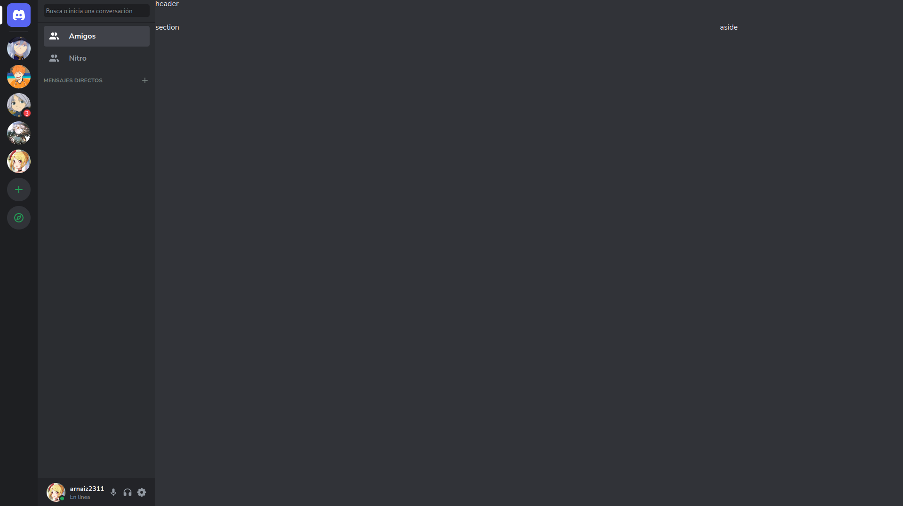
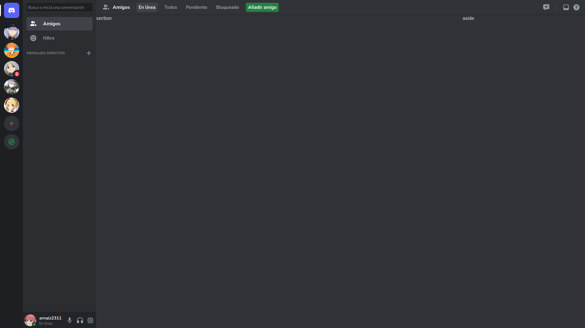

# Discord clone layout

Repositorie where I create the discord layout with HTML, CSS and JS.

## Previews

### Nav

### Messages

### Header

## Missing

* [ ] footer messages icons silent
* [x] footer messages hover
* [ ] chat user messages
* [x] header
* [ ] main
* [ ] main user more
* [ ] aside
* [ ] md submenu
* [ ] inbox submenu
* [x] navbar server hover left
* [x] messages create md hover
