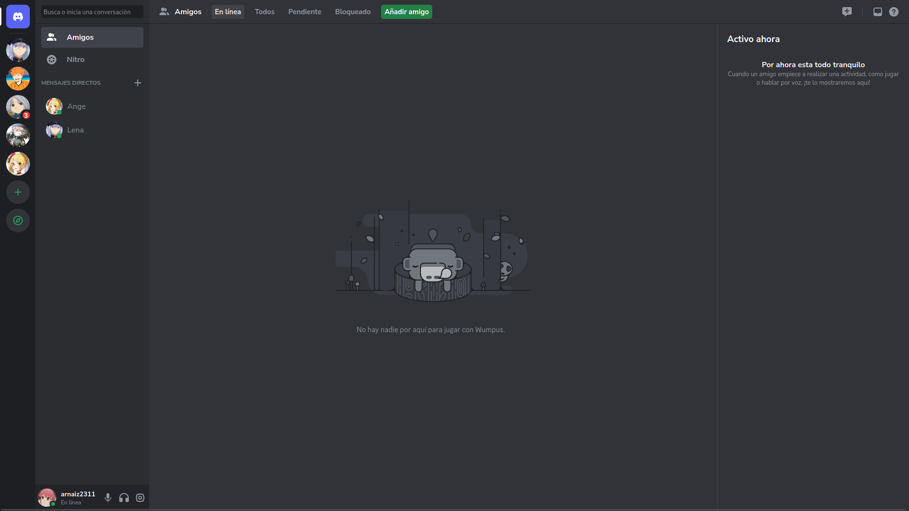
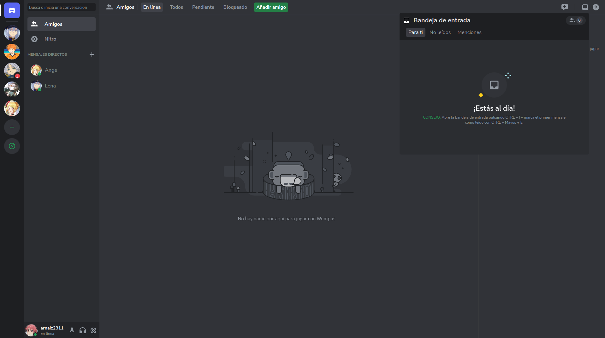
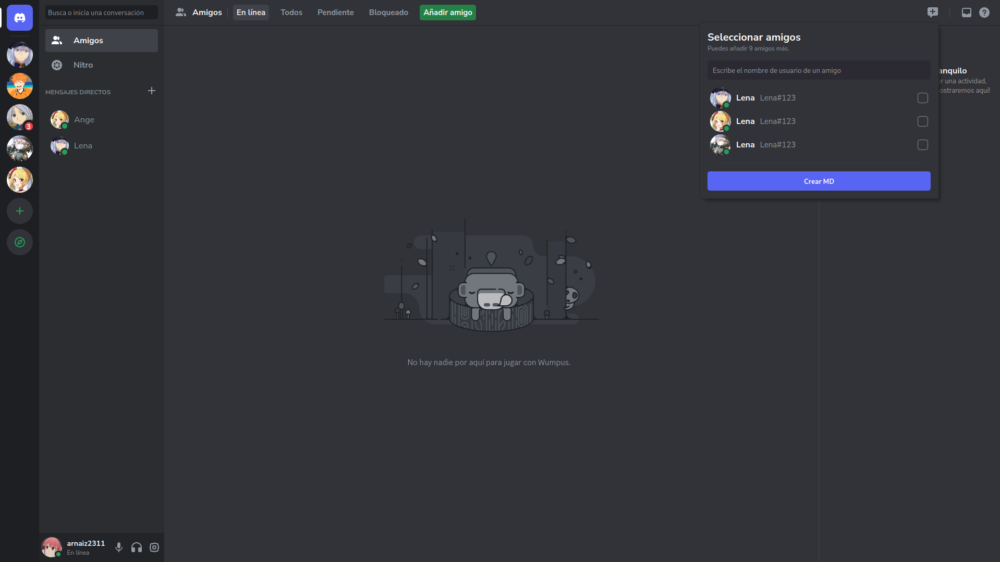
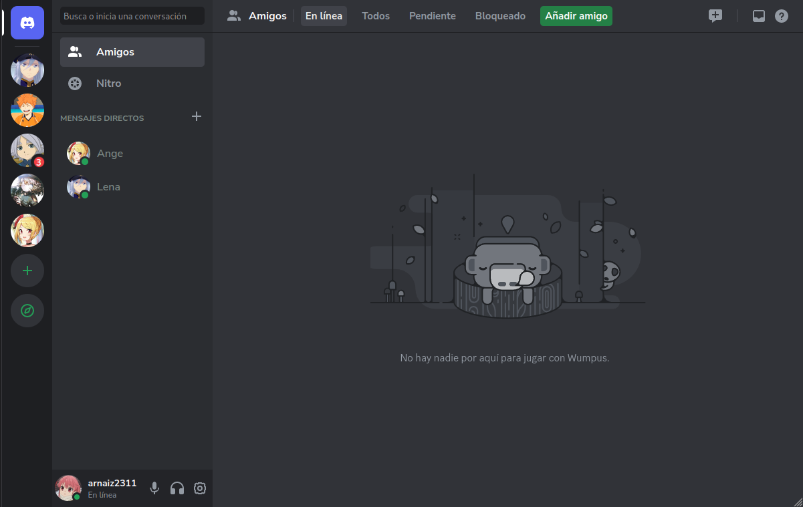

# Discord clone layout

Repositorie where I create the discord layout with HTML, CSS and JS. 

**Url**: https://discord-arnaizdev.netlify.app

## Previews

### Nav

### Messages

### Header

### Main & aside

 
### Inbox modal

### MD modal

### Responsive

## Missing

* [ ] footer messages icons silent
* [x] footer messages hover
* [x] chat user messages
* [x] header
* [x] main
* [x] aside
* [x] md submenu
* [x] inbox submenu
* [x] navbar server hover left
* [x] messages create md hover
* [x] Responsive
* [x] Checkbox style
* [x] Deploy and add to the portfolio
