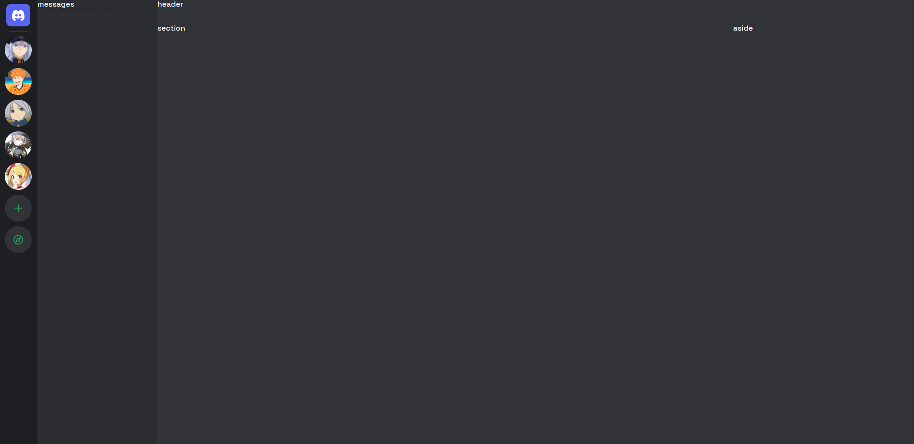

# Discord clone layout

Repositorie where I create the discord layout with HTML, CSS and JS.

## Previews

### Nav

## Missing

* [ ] footer messages icons silent
* [ ] footer messages hover
* [ ] chat user messages
* [ ] header
* [ ] main
* [ ] main user more
* [ ] aside
* [ ] md submenu
* [ ] inbox submenu
* [ ] navbar server hover left
